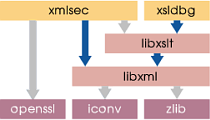

# Bibliotecas abertas GNU: Dependências de Bibliotecas para portar para Windows

- libxml2
- libxslt
- xmlsec
- xsldbg
- OpenSSL
- iconv
- zlib

# Matriz de dependência entre as bibliotecas:

# Bibloteca DLL do windows (fechada)
- msvcrt.dll
