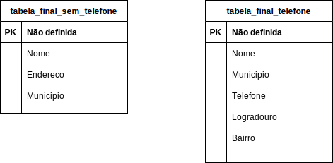
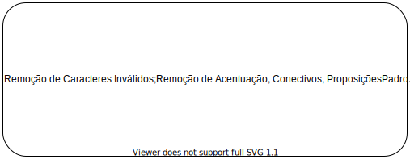

# 1 - Exercícios

## 1.1 - Exercício 1 - Limpeza de dados
Escolha o método de sua preferência e faça a limpeza dos dados nas tabelas abaixo



### 1.1.1 - Tabela do cadastro sem o atributo telefone 
 - *Nome*      - atributo estringue
 - *Endereco*  - atributo estringue
 - *Municipio* - atributo numérico (geocódigo IBGE)

### 1.1.2 - Tabela do cadastro com o atributo telefone
 - *Nome*       - atributo estringue
 - *Municipio*  - atributo estringue (nome do município)
 - *Telefone*   - atributo estringue (atributo estringue)
 - *Logradouro* - atributo estringue (atributo estringue)
 - *Bairro*     - atributo estringue (atributo estringue)

**Objetivo**: Usar deduplicação para encontrar os possíveis pareamentos de **nomes** e **telefones**.
**Visão Global do Processo:**
 - **Limpeza e Padronização**
 - **Blocagem**
 - **Estimativa de Parâmetros**
 - **Comparação**
 - **Classificação e Conferência**
 - **Avaliação**

Carregue os *Datasets* em sua ferramenta preferida para a executar limpeza e padronização dos dados:
**ferramenta escolhida:** SQL

### 1.1.3 - Carregando os dados em SGBD Postgres:

Criando o script para importar os *Datasets* para dentro do Sistema de Gerênciamento de Banco de Dados:

```sql
/*
Se quiser criar um usuário gernérico para este exercício segue
*/

/*
REATE ROLE "administrador-banco" LOGIN
  ENCRYPTED PASSWORD 'senhabanco'
  SUPERUSER INHERIT CREATEDB CREATEROLE REPLICATION;
COMMENT ON ROLE "administrador-banco" IS 'Administrador do Banco de Dados.';
*/

/*
Se quiser criar um banco de dados para os exercícios do curso
segue
*/

/*
CREATE DATABASE "curso-pareamento-ibge"
  WITH OWNER = "administrador-banco"
       ENCODING = 'UTF8'
       TABLESPACE = pg_default
       LC_COLLATE = 'pt_BR.UTF-8'
       LC_CTYPE = 'pt_BR.UTF-8'
       CONNECTION LIMIT = -1;

COMMENT ON DATABASE 
	"curso-pareamento-ibge"
IS 
	'Curso de Paremaneto de Datasets do professor Ramon Pereira ';

*/

/*
Vamos criar esquemas (uma espécie de diretórios em bancos de dados)
para acomodar as tabelas
*/

DROP SCHEMA IF EXISTS "dados-importados-butos";
CREATE SCHEMA "dados-importados-butos" AUTHORIZATION "administrador-banco";

DROP SCHEMA IF EXISTS "dados-limpos-padronizados";
CREATE SCHEMA "dados-limpos-padronizados" AUTHORIZATION "administrador-banco";

/*
Criando as tabelas para conter os 2 datasets importados
*/

DROP TABLE IF EXISTS "dados-importados-butos".tabela_final_sem_telefone;

CREATE TABLE IF NOT EXISTS "dados-importados-butos".tabela_final_sem_telefone
(
	"Nome"      character varying(500),
	"Endereco"  character varying(500),
	"Municipio" character varying(500)
)
WITH ( OIDS=FALSE );
ALTER TABLE "dados-importados-butos".tabela_final_sem_telefone OWNER TO "administrador-banco";

DROP TABLE IF EXISTS "dados-importados-butos".tabela_final_telefone;

CREATE TABLE IF NOT EXISTS "dados-importados-butos".tabela_final_telefone
(
	"Nome"      character varying(500),
	"Municipio" character varying(500),
	"Telefone"  character varying(500),
	"Logrdouro" character varying(500),
	"Bairro"    character varying(500)
)
WITH ( OIDS=FALSE );
ALTER TABLE "dados-importados-butos".tabela_final_telefone OWNER TO "administrador-banco";

```
### 1.1.4 - Importando os dados

```bash
mkdir -p /tmp/a 
cp tabela_final_sem_telefone.csv /tmp/a
cp tabela_final_telefone.csv     /tmp/a
psql -U administrador-banco -h 127.0.0.1 -d "curso-pareamento-ibge"  -a  <<EOF 

EOF
```


### 1.1.5 Limpeza e Padronização

 - Remoção de Caracteres Inválidos;
 - Remoção de Acentuação, Conectivos, Proposições;
 - Padronização no número de dígitos dos campos;
 - Validação da veracidade da informação;
 - Separação dos campos e determinação dos conjuntos;
 - Tipos de Dados;


